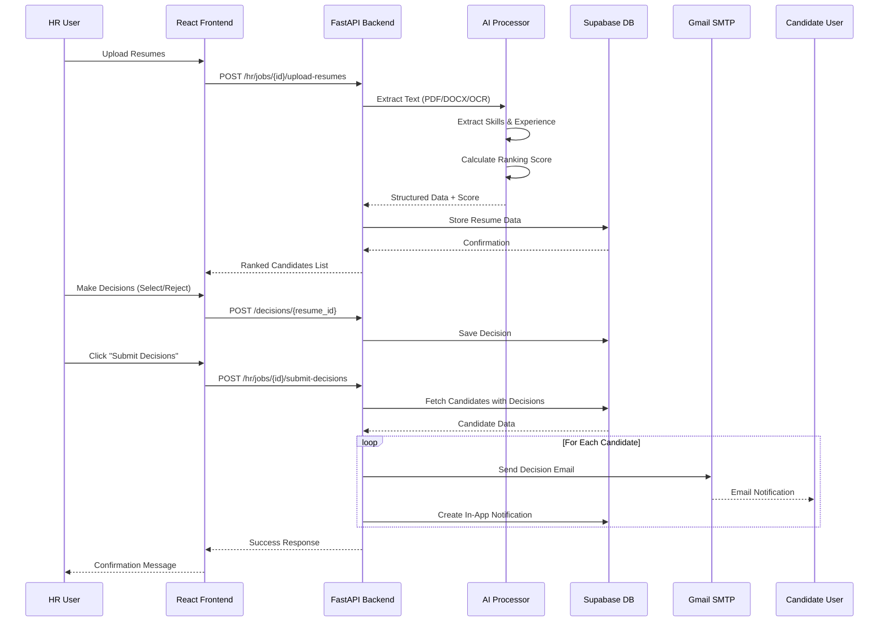
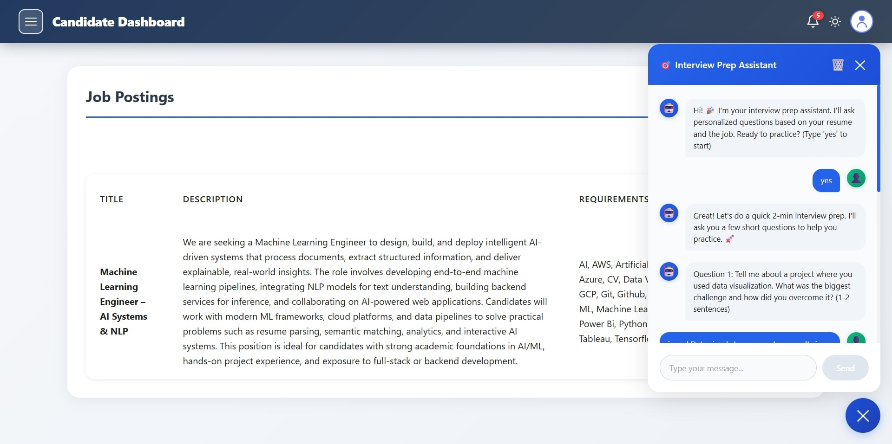
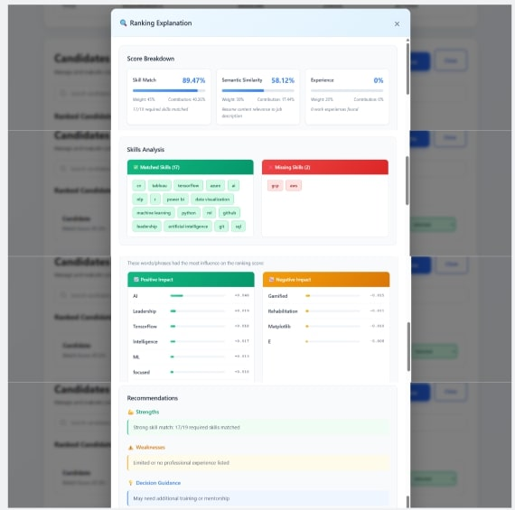

# AI-Driven Resume Screening System with Chatbot Integration

An intelligent recruitment platform that automates end-to-end resume screening using AI/ML, delivering reliable candidate rankings, transparent explanations, and a seamless interview-preparation experience via an interactive chatbot. The system combines robust document parsing (PDF/DOCX/OCR), semantic matching with Sentence‑Transformers, fuzzy skill extraction, and fairness checks to help HR teams shortlist candidates faster while reducing bias and improving hiring quality.

Designed for scalability and extensibility, the project exposes REST APIs for integrations, supports role-based dashboards for HR and candidates, and includes automated notifications and explainability features (LIME + score breakdowns) so decisions remain auditable. Built as an academic capstone, it demonstrates production-ready patterns (JWT auth, async FastAPI, modular services) and serves as a foundation for future enhancements like S3 storage, interview scheduling, and multi-language support.

[](https://reactjs.org/)
[](https://fastapi.tiangolo.com/)
[](https://rasa.com/)
[](https://www.python.org/)

---

## 📋 Table of Contents
- [Overview](#overview)
- [Features](#features)
- [Architecture](#architecture)
- [Technology Stack](#technology-stack)
- [Installation](#installation)
- [Usage](#usage)
- [Documentation](#documentation)
- [Team](#team)
- [License](#license)

---

## 🎯 Overview

The AI-Driven Resume Screening System is a comprehensive web application designed to streamline the recruitment process for HR professionals while enhancing the candidate experience. Built as a major project at **CMR Institute of Technology, Bengaluru**, this system leverages cutting-edge AI/ML technologies to automate resume screening, provide intelligent rankings, and offer interview preparation assistance.

### Key Capabilities
- **Automated Resume Parsing**: Supports PDF, DOCX, PNG, and JPEG formats
- **AI-Powered Ranking**: Multi-factor scoring using semantic similarity and skill matching
- **Explainable AI**: Transparent decision-making with score breakdowns
- **Bias Detection**: Fairlearn integration for fair hiring practices
- **Interview Chatbot**: Rasa-powered assistant for candidate preparation
- **Email Notifications**: Automated candidate updates
- **Dual Dashboards**: Separate interfaces for HR and candidates

---

## ✨ Features

### For HR Professionals
- 📝 **Job Posting Management**: Create and manage job descriptions with requirements
- 📤 **Bulk Resume Upload**: Process multiple resumes simultaneously (PDF/DOCX/Images)
- 🤖 **AI-Powered Ranking**: Automatic candidate scoring based on:
  - Skill matching (45% weight)
  - Semantic similarity (30% weight)
  - Experience relevance (20% weight)
  - Education level (5% weight)
- 📊 **Explainable AI**: Understand why each candidate received their score
- ✅ **Decision Workflow**: Select, reject, or mark candidates as pending
- 📧 **Email Notifications**: Automated emails sent to candidates upon decision submission
- 📈 **Bias Detection**: Fairlearn metrics to ensure fair evaluation

### For Candidates
- 📱 **Application Tracking**: View status of all job applications
- 💬 **Interview Prep Chatbot**: 24/7 AI assistant offering:
  - Common interview questions practice
  - STAR method guidance for behavioral questions
  - Technical interview tips
  - Role-specific advice
- 🔔 **Notifications**: Real-time updates on application status
- 📊 **Score Visibility**: See ranking scores and feedback

---

## 🏗️ Architecture

```mermaid
graph TB
    subgraph "Frontend Layer"
        A[React Application<br/>Port 3000]
        A1[Landing Page]
        A2[Login/Register]
        A3[HR Dashboard]
        A4[Candidate Dashboard]
        A --> A1
        A --> A2
        A --> A3
        A --> A4
    end

    subgraph "Backend Layer"
        B[FastAPI Server<br/>Port 8000]
        B1[Authentication<br/>JWT + Supabase]
        B2[Job Management<br/>CRUD Operations]
        B3[AI Processor<br/>Resume Analysis]
        B4[Email Service<br/>Gmail SMTP]
        B --> B1
        B --> B2
        B --> B3
        B --> B4
    end

    subgraph "AI/ML Layer"
        C1[Text Extraction<br/>pdfplumber, pytesseract]
        C2[Skill Extraction<br/>spaCy, rapidfuzz]
        C3[Semantic Ranking<br/>Sentence-BERT]
        C4[Explainability<br/>LIME]
        C5[Bias Detection<br/>Fairlearn]
        B3 --> C1
        B3 --> C2
        B3 --> C3
        B3 --> C4
        B3 --> C5
    end

    subgraph "Chatbot Layer"
        D[Rasa Server<br/>Port 5005]
        D1[NLU Pipeline<br/>DIET Classifier]
        D2[Dialogue Management<br/>TED Policy]
        D3[Action Server<br/>Port 5055]
        D4[Custom Actions<br/>Interview Questions]
        D --> D1
        D --> D2
        D --> D3
        D3 --> D4
    end

    subgraph "Database Layer"
        E[(Supabase PostgreSQL)]
        E1[user_profiles]
        E2[job_descriptions]
        E3[resumes]
        E4[notifications]
        E --> E1
        E --> E2
        E --> E3
        E --> E4
    end

    subgraph "External Services"
        F[Gmail SMTP<br/>Email Delivery]
    end

    A -->|HTTP/REST| B
    A -->|WebSocket| D
    B -->|SQL| E
    B4 -->|SMTP| F
    D3 -->|Python| D4

    style A fill:#61dafb,stroke:#333,stroke-width:2px,color:#000
    style B fill:#009688,stroke:#333,stroke-width:2px,color:#fff
    style D fill:#5a67d8,stroke:#333,stroke-width:2px,color:#fff
    style E fill:#3ecf8e,stroke:#333,stroke-width:2px,color:#000
    style C3 fill:#ff9800,stroke:#333,stroke-width:2px,color:#000
```



### Data Flow



---

## 🛠️ Technology Stack

### Frontend
| Technology | Version | Purpose |
|------------|---------|---------|
| **React** | 18.2.0 | UI framework for building interactive interfaces |
| **Material-UI** | 5.18.0 | Pre-built components with Material Design |
| **React Router** | 6.30.1 | Client-side routing and navigation |
| **Axios** | 1.12.2 | HTTP client for API communication |
| **React Simple Chatbot** | 0.6.1 | Chat interface for Rasa integration |

### Backend
| Technology | Version | Purpose |
|------------|---------|---------|
| **FastAPI** | Latest | Modern, high-performance web framework |
| **Python** | 3.11 | Programming language |
| **Supabase** | Latest | PostgreSQL database with built-in authentication |
| **Uvicorn** | Latest | ASGI server for FastAPI |
| **python-dotenv** | Latest | Environment variable management |

### AI/ML
| Technology | Version | Purpose |
|------------|---------|---------|
| **Sentence-Transformers** | Latest | Semantic text similarity (all-mpnet-base-v2 model) |
| **PyTorch** | Latest | Deep learning backend |
| **spaCy** | Latest | NLP pipeline and named entity recognition |
| **rapidfuzz** | Latest | Fuzzy string matching for skill variants |
| **LIME** | Latest | Explainable AI (model interpretability) |
| **Fairlearn** | Latest | Bias detection and fairness metrics |
| **scikit-learn** | Latest | Traditional ML algorithms |

### Document Processing
| Technology | Version | Purpose |
|------------|---------|---------|
| **pdfplumber** | Latest | PDF text extraction |
| **python-docx** | Latest | Microsoft Word document parsing |
| **pytesseract** | Latest | OCR for image-based resumes |
| **OpenCV** | Latest | Image preprocessing for OCR |

### Chatbot
| Technology | Version | Purpose |
|------------|---------|---------|
| **Rasa** | 3.x | Open-source conversational AI framework |
| **Rasa SDK** | Latest | Custom action server |
| **TensorFlow** | Latest | Deep learning backend for Rasa |

### Email & Notifications
| Technology | Version | Purpose |
|------------|---------|---------|
| **smtplib** | Built-in | Email sending via Gmail SMTP |
| **python-jose** | Latest | JWT token handling |

---

## 📦 Installation

### Prerequisites
- **Python** 3.11 or higher
- **Node.js** 18.x or higher
- **npm** or **yarn**
- **Git**

### 1. Clone the Repository
```bash
git clone https://github.com/Anvitha-git/AI-Driven-Resume-Screening.git
cd AI-Driven-Resume-Screening
```

### 2. Backend Setup

```bash
# Navigate to backend directory
cd backend

# Create virtual environment (Windows)
python -m venv venv
.\venv\Scripts\activate

# Create virtual environment (Linux/Mac)
python3 -m venv venv
source venv/bin/activate

# Install dependencies
pip install -r requirements.txt

# Download spaCy model
python -m spacy download en_core_web_sm

# Create .env file
# Add the following variables:
# SUPABASE_URL=your_supabase_url
# SUPABASE_KEY=your_supabase_key
# JWT_SECRET=your_jwt_secret
# EMAIL_HOST=smtp.gmail.com
# EMAIL_PORT=587
# EMAIL_USE_TLS=True
# EMAIL_HOST_USER=your_email@gmail.com
# EMAIL_HOST_PASSWORD=your_gmail_app_password
# EMAIL_FROM_NAME=HR Team - AI Resume Screening System

# Run the server
uvicorn main:app --host 0.0.0.0 --port 8000 --reload
```

**Backend API Documentation:** http://localhost:8000/docs

### 3. Frontend Setup

```bash
# Navigate to frontend directory
cd frontend/c

# Install dependencies
npm install

# Start development server
npm start
```

**Frontend Application:** http://localhost:3000

### 4. Chatbot Setup

```bash
# Navigate to chatbot directory
cd chatbot

# Install Rasa (if not already installed)
pip install rasa

# Train the model
rasa train

# Terminal 1: Start action server
rasa run actions --port 5055

# Terminal 2: Start Rasa server
rasa run --enable-api --cors "*" --port 5005
```

**Rasa API:** http://localhost:5005

---

## 🚀 Usage

### For HR Users

1. **Register/Login**
   - Create an account with role "HR"
   - Login with credentials

2. **Create Job Posting**
   - Click "Create Job"
   - Fill in job title, description, requirements, location, salary
   - Submit to post the job

3. **Upload Resumes**
   - Select a job posting
   - Click "Upload Resumes"
   - Choose multiple files (PDF, DOCX, PNG, JPEG)
   - Wait for AI processing (~2-3 seconds per resume)

4. **Review Rankings**
   - View candidates sorted by AI score (highest first)
   - See color-coded scores:
     - 🟢 Green (80-100%): Excellent match
     - 🟡 Yellow (60-79%): Good match
     - 🔴 Red (0-59%): Poor match
   - Click "Why this score?" to see explanation

5. **Make Decisions**
   - Select decision from dropdown: Selected/Rejected/Pending
   - Decisions saved automatically
   - Click "Submit Decisions" to send emails to all candidates

6. **View Explanation**
   - Click "Explain Score" button
   - See breakdown:
     - Skill match contribution
     - Semantic similarity score
     - Experience evaluation
     - Education level
   - View matched vs missing skills

### For Candidates

1. **Register/Login**
   - Create account with role "Candidate"
   - Login with credentials

2. **Track Applications**
   - View all job applications
   - See status: Selected/Rejected/Pending
   - Check ranking scores

3. **Interview Preparation**
   - Click chatbot icon (bottom right)
   - Practice common interview questions
   - Get tips on:
     - STAR method for behavioral questions
     - Technical interview strategies
     - General interview advice

4. **Receive Notifications**
   - Check notification bell for updates
   - Receive emails when decisions are made

---

## 📷 Screenshots

- Candidate Dashboard


- Chatbot Conversation



- HR Dashboard


- Landing Page


- LIME Explainability Example



- Login Page


- Resume Ranking View


- Signup Page


---

## 📚 Documentation

Detailed documentation for each component is available in the `docs/` folder:

- **[Backend Documentation](docs/BACKEND_DOCUMENTATION.md)**
  - Technology stack and architecture
  - AI/ML features (Sentence-BERT, LIME, Fairlearn)
  - Resume parsing and ranking algorithm
  - Email notification system
  - API endpoints and database schema
  - Why we chose these technologies

- **[Frontend Documentation](docs/FRONTEND_DOCUMENTATION.md)**
  - React component architecture
  - State management with localStorage
  - Material-UI integration
  - Routing and navigation
  - Decision workflow implementation
  - UI/UX design patterns

- **[Chatbot Documentation](docs/CHATBOT_DOCUMENTATION.md)**
  - Rasa NLU pipeline and training data
  - Conversation flow and intent classification
  - Custom actions for interview prep
  - Integration with frontend
  - DIET classifier vs alternatives

- **[Project Summary](docs/README.md)**
  - Quick reference guide
  - Feature comparison
  - Performance metrics
  - Future roadmap

---

## 👥 Team

This project was developed as a **Major Project** at **CMR Institute of Technology, AECS Layout, Bengaluru - 560037**.

### Team Members

**Department of Artificial Intelligence and Machine Learning**

| Name | USN | Role | Responsibilities |
|------|-----|------|------------------|
| **Anvitha S** | 1CR22AI019 | Frontend & Chatbot Developer | React Integration, Rasa Chatbot Implementation |
| **Lingeshwari S** | 1CR22AI062 | Frontend & Chatbot Developer | React UI, Rasa Chatbot UI |
| **Pranav V** | 1CR22AI088 | Backend & AI/ML Developer | FastAPI, AI Ranking Algorithm, Resume Processing |
| **Shariq Sheikh** | 1CR22AI102 | Backend & AI/ML Developer | Supabase Integration, Email Service, Bias Detection |

### Project Mentorship

**Major Project Guide**  
**Mr. Adarsh Benjamin**  
Associate Professor, Department of Artificial Intelligence and Machine Learning  
CMR Institute of Technology

**Head of Department**  
**Dr. Shyam P Joy**  
Department of Artificial Intelligence and Machine Learning  
CMR Institute of Technology

### Academic Institution
**CMR Institute of Technology**  
Department of Artificial Intelligence and Machine Learning  
AECS Layout, Bengaluru - 560037  
Karnataka, India

---

## 🎓 Project Highlights

### AI/ML Innovations
- **Multi-factor Ranking Algorithm**: Combines skill matching, semantic similarity, experience, and education
- **Explainable AI**: LIME-based explanations for transparency
- **Bias Detection**: Fairlearn integration ensures fair hiring practices
- **Semantic Search**: Sentence-BERT (all-mpnet-base-v2) for context-aware matching

### Technical Achievements
- **Full-stack Implementation**: React + FastAPI + Rasa
- **Real-time Processing**: < 3 seconds for 50 resume ranking
- **Scalable Architecture**: Async FastAPI, client-side React routing
- **Production-ready**: JWT auth, email notifications, error handling

### User Experience
- **Intuitive UI**: Material Design components
- **Responsive Design**: Works on mobile, tablet, desktop
- **Interactive Chatbot**: 24/7 interview preparation assistant
- **Transparent AI**: Users understand why decisions were made

---

## 🔒 Security Features

- ✅ JWT token-based authentication
- ✅ Password hashing (Supabase)
- ✅ Role-based access control (HR/Candidate)
- ✅ TLS encryption for email (Gmail SMTP)
- ✅ Environment variable protection (.env)
- ✅ CORS configuration for API security

---

## 📊 Performance

- **Resume Parsing**: < 2 seconds per file
- **AI Ranking**: < 3 seconds for 50 resumes
- **Explanation Generation**: < 1 second
- **Chatbot Response**: < 300ms
- **Email Delivery**: ~2 seconds per email

---

## 🚀 Future Enhancements

- [ ] Resume file storage (AWS S3 / Supabase Storage)
- [ ] Advanced filtering (experience range, location, skills)
- [ ] Interview scheduling integration (Google Calendar)
- [ ] Analytics dashboard (hire rate, time-to-hire metrics)
- [ ] Mobile application (React Native)
- [ ] Video interview analysis (facial expressions, tone)
- [ ] Multi-language support for chatbot
- [ ] Fine-tuned BERT model on resume datasets

---

## 📝 License

This project is developed for academic purposes as part of the curriculum at CMR Institute of Technology, Bengaluru.

---

## 🙏 Acknowledgments

- **Dr. Shyam P Joy**, Head of Department, AI & ML, CMR Institute of Technology, for his guidance and support
- **Mr. Adarsh Benjamin**, Associate Professor, AI & ML, CMR Institute of Technology, for his mentorship throughout the project
- **CMR Institute of Technology** for providing resources and infrastructure
- **Open-source community** for amazing libraries (React, FastAPI, Rasa)
- **Hugging Face** for Sentence-Transformers models
- **Supabase** for database and authentication services
- **Material-UI** team for beautiful React components

---

## 📧 Contact

For queries or collaboration opportunities, please reach out:

**Email**: airesumescreening@gmail.com

---

<div align="center">
  <p>Made with ❤️ by Team AI-Resume-Screening</p>
  <p>CMR Institute of Technology, Bengaluru</p>
  <p>© 2025 All Rights Reserved</p>
</div>
